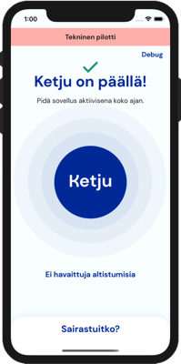

# Ketjun iOS-sovellus

[In English](#ketju-ios-application)

## Konteksti

Ketju-pilottiprojektin iOS-sovelluksen lähdekoodi.

## Esittely

Ketju iOS on [COVID-19](https://fi.wikipedia.org/wiki/COVID-19)-altistumisilmoitussovellus, joka käyttää [DP3T-SDK](https://github.com/DP-3T/dp3t-sdk-ios) -kirjastoa lähietäisyydellä olevien toisten sovelluskäyttäjien havainnointiin Bluetooth-teknologian avulla. Ketju-pilotti käyttää DP3T-kehittäjien alkuperäistä Bluetooth-protokollaa ennen [Applen](https://developer.apple.com/documentation/exposurenotification) ja [Googlen](https://www.google.com/covid19/exposurenotifications/) julkaiseman korvaavan Exposure Notification -rajapinnan käyttöönottoa.

## Tarkoitus

Ketju-pilottiprojektin tarkoitus on testata DP3T:n Bluetooth-protokollan sovelutuvuutta ja tarkkuutta lähikontaktien määrittämisessä. Erityisesti iOS-sovelluksen osalta kiinnostavaa on myös sovelluksen toiminta tausta-ajossa iOS-käyttöjärjestelmän tausta-ajon rajoituksista johtuen. Tämä sovellus ei ole tuotantovalmis.

## Käyttöönotto

Jotta Ketju-sovellusta voi käyttää ja ajaa, muutamalle projektin ympäristömuuttujalle on määriteltävä ensin arvot. Muokkaa näitä valitsemalla Xcode:ssa projekti sekä sen jälkeen `Ketju -> Build Settings -> User-Defined`. Sovellukseen liittyy kolme oleellista ympäristömuuttujaa:

| Ympäristömuuttuja                    | Kuvaus                                               |
|--------------------------------------|------------------------------------------------------|
| `KETJU_BACKEND_URL`                  | DP3T-taustajärjestelmän osoite                       |
| `KETJU_BACKEND_JWT_PUBLIC_KEY`       | DP3T-taustajärjestelmän vaatima julkinen avain       |
| `KETJU_BACKEND_CERTIFICATE_FILENAME` | Taustajärjestelmän käyttämän varmenteen tiedostonimi |

Voit määrittää erilliset arvot kehitys- ja tuotantoversioita varten seuraavan esimerkin mukaisesti:

Muokkaa näitä ympäristömuuttujia siten, että ne vastaavat käytetyn taustajärjestelmän konfiguraatiota. `KETJU_BACKEND_URL` on edellä mainituista muuttujista ainoa, joka on määriteltävä. Muut ympäristömuuttujat voidaan jättää tyhjiksi.

### Varmenteen kiinnitys

Käyttääksesi varmenteen kiinnitystä (*eng. certificate pinning*) lisää varmennetiedosto sovelluspakettiin ja aseta sen tiedostonimi `KETJU_BACKEND_CERTIFICATE_FILENAME` ympäristömuuttujaan. Mikäli kyseisen ympäristömuuttujan arvo jätetään tyhjäksi, varmenteen kiinnitystä ei käytetä.

## Riippuvuudet

- [DP3T-SDK for iOS](https://github.com/ketjusovellus/dp3t-sdk-ios)
- [SnapKit](https://github.com/SnapKit/SnapKit)
- [Lottie](https://github.com/airbnb/lottie-ios)

Kaikki sovelluksen käyttämät riippuvuudet on lisätty Swift-paketteina Swift Package Manager -pakettienhallintatyökalulla.

## Muutoksista DP3T-SDK-kirjastoon

Ketju-pilotin testivaihetta varten [DP3T-SDK-kirjastoon](https://github.com/DP-3T/dp3t-sdk-ios) on tehty [muutoksia](https://github.com/ketjusovellus/dp3t-sdk-ios), joilla tallennetaan tarkempaa tietoa *kohtaamisista (eng. contact)* ja *kättelyistä (eng. handshake)* sovelluksen sisäiseen kohtaamistietokantaan. Näitä tarkempia tietoja hyödyntäen voidaan arvioida testijakson aikana Bluetoothilla kerättyjä kohtaamistietojen luotettavuutta vertailemalla niitä testikäyttäjien manuaalisesti kirjaamiin kohtaamisiin.

Jotta testikäyttäjien kohtaamiset saadaan tunnistettua ja yksilöityä, on DP3T-SDK-kirjastoon tehty olennainen muutos Bluetooth-kättelyiden yhteydessä laitteiden välillä vaihdettaviin *lyhytaikaistunnisteisiin (eng. ephemeral identifier)*, joihin on lisätty neljän tavun mittainen etuliite. Tämä voidaan muodostaa esimerkiksi testihenkilön nimikirjaimista tai valita satunnaisesti testihenkilöä kohden. Toisin kuin DP3T-SDK:n normaalissa anonyymissa toimintatilassa, etuliitteellinen lyhytaikaistunniste on yhdistettävissä tiettyyn testikäyttäjään, jolloin kerätyt kohtaamistiedot testihenkilöiden välillä voidaan yhdistää toisiinsa jälkikäteen. Yhdistelemällä tietoa kohtaamisen alku- ja loppuajasta sekä lasketusta etäisyydestä voidaan datasta luoda erilaisia visualisaatioita, kuten aikajanoja eri testihenkilöiden kohtaamisista, ja näin vertailla sovelluksen avulla kerättyä ja manuaalisesti kirjattua kohtaamisdataa keskenään.

Lisäykset *kohtaamistietoihin* (*contacts*-tauluun):

- Etuliite lyhytaikaistunnisteeseen (*ephemeral identifier*)
- Kohtaamisen alku- ja loppuaika pelkän päiväystiedon lisäksi
- Kohtaamisen kesto
- Signaalin keskimääräinen vaimenema kohtaamisen ajalta
- Signaalin vaimenemasta laskettu keskimääräinen etäisyys kohtaamisen ajalta

Lisäykset *kättelytietoihin* (*handshakes* -tauluun)

- Etuliite lyhytaikaistunnisteeseen (*ephemeral identifier*)
- Etäisyys, joka on laskettu ilmoitetusta lähetystehosta (TX power) ja vastaanotetusta signaalin voimakkuuden mittaustuloksesta (RSSI).

Nämä yllä mainitut muokkaukset ovat tarkoitettu **ainoastaan** testikäyttöä ja Bluetooth-jäljitysprotokollan toimivuuden varmistamista varten, eikä näitä muokkauksia tule **milloinkaan** sisällyttää sovelluksen tuotantoversioon.

# Ketju iOS application

## Context

The iOS application source code of Ketju Pilotti project.

## Introduction

Ketju iOS is a [COVID-19](https://en.wikipedia.org/wiki/Coronavirus_disease_2019) exposure notification mobile application, using [DP3T-SDK](https://github.com/DP-3T/dp3t-sdk-ios) library for proximity tracing over Bluetooth to detect close contacts between other application users. Ketju Pilotti uses the initial Bluetooth protocol introduced by the DP3T team, prior to the introduction and their adaptation to use the new Exposure Notification API by [Apple](https://developer.apple.com/documentation/exposurenotification) and [Google](https://www.google.com/covid19/exposurenotifications/) instead.

## Purpose

The purpose of Ketju Pilotti project is to test feasibility and measure accuracy of contact detection with DP3T Bluetooth protocol. A special interest on iOS is also to test application background operation given the limitations of iOS operating system. This is not a production ready application.

## Setup

In order to successfully build & run Ketju, you need to define values for some User-Defined variables. Modify them by selecting project and `Ketju -> Build Settings -> User-Defined` in Xcode. There are three variables:

| Variable                             | Description                                          |
|--------------------------------------|------------------------------------------------------|
| `KETJU_BACKEND_URL`                  | Base URL of the DP3T backend                         |
| `KETJU_BACKEND_JWT_PUBLIC_KEY`       | Public key string for the DP3T backend               |
| `KETJU_BACKEND_CERTIFICATE_FILENAME` | Filename of the backend certificate used for pinning |

You can separate dev and production versions for these variables like here:

Modify these variables to reflect your backend configuration. `KETJU_BACKEND_URL` is only mandatory information, others can be left empty.

### Certificate pinning

To enable certificate pinning, add the certificate file into the app bundle and define it's filename in `KETJU_BACKEND_CERTIFICATE_FILENAME` variable. If you leave that value empty, certificate pinning will be disabled.

## Dependencies

- [DP3T-SDK for iOS](https://github.com/ketjusovellus/dp3t-sdk-ios)
- [SnapKit](https://github.com/SnapKit/SnapKit)
- [Lottie](https://github.com/airbnb/lottie-ios)

All dependencies are added as Swift packages by Swift Package Manager.

## Modifications of DP3T-SDK

A custom [fork](https://github.com/ketjusovellus/dp3t-sdk-ios) of [DP3T-SDK](https://github.com/DP-3T/dp3t-sdk-ios) is used in Ketju Pilotti test phase to store more detailed *contact* and *handshake* information into the internal contact database. An export of this database file can be used afterwards to validate the generated contact data with the actual documented real life contacts between the application test users.

A custom 4 byte prefix identifier, like initials of a test user, can be set and used on the frequently changing *ephemeral identifiers* of the user, used in the contact data exchange of the Bluetooth protocol. Unlike in the normal anonymous operation, the prefixed *ephemeral identifiers* can be directly linked to individual test users and thus be used to generate contact timelines between different test users and hence to verify the data with actual observations.

Extensions of *contact* data:
- Custom prefix identifier
- Start and end time, in addition to date
- Contact duration
- Mean signal attenuation over the contact
- Mean distance, calculated from the mean attenuation, over the contact

Extensions of *handshake* data:
- Custom prefix identifier
- Distance, calculated from the TX power level and RSSI

These modifications are meant to be used **only** for verification purposes of the Bluetooth proximity tracing protocol in a testing phase and to **never** included in any production release.
